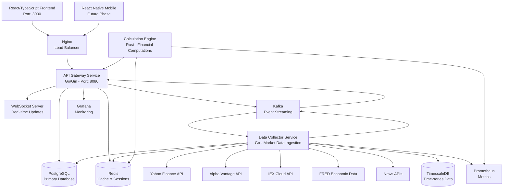

# System Architecture - Bloomberg Terminal Alternative

## 🏗️ **High-Level Architecture**

Our Bloomberg Terminal Alternative follows a **microservices architecture** with **event-driven communication** and **multi-language implementation** for optimal performance.



## 🎯 **Design Principles**

### **1. Single Responsibility Principle**
Each service has a clear, focused responsibility:

| Service | Responsibility | Why This Language |
|---------|----------------|-------------------|
| **Data Collector** | Market data ingestion, API orchestration | Go - Excellent concurrency, HTTP client ecosystem |
| **Calculation Engine** | Financial computations, risk analytics | Rust - Maximum performance, memory safety |
| **API Gateway** | Client interface, request routing | Go - Great web frameworks, middleware support |
| **Frontend** | User interface, data visualization | TypeScript - Type safety, React ecosystem |

### **2. Separation of Concerns**

```
┌─────────────────────────────────────────────────────────┐
│                    Presentation Layer                    │
├─────────────────────────────────────────────────────────┤
│                    Application Layer                     │
├─────────────────────────────────────────────────────────┤
│                     Business Layer                      │
├─────────────────────────────────────────────────────────┤
│                   Data Access Layer                     │
├─────────────────────────────────────────────────────────┤
│                  Infrastructure Layer                   │
└─────────────────────────────────────────────────────────┘
```

### **3. Event-Driven Communication**

Services communicate primarily through events, enabling:
- **Loose coupling** between services
- **Asynchronous processing** for better performance
- **Event sourcing** for audit trails
- **Real-time updates** to frontend clients

---

## 🔧 **Service Deep Dive**

### **Data Collector Service (Go)**

**Purpose**: Orchestrate data collection from multiple external APIs and normalize data.

```go
// Service Structure
services/data-collector/
├── cmd/
│   └── server/
│       └── main.go              // Service entry point
├── internal/
│   ├── collector/
│   │   ├── collector.go         // Main orchestrator
│   │   ├── yahoo_finance.go     // Yahoo Finance API client
│   │   ├── alpha_vantage.go     // Alpha Vantage API client
│   │   ├── iex_cloud.go         // IEX Cloud API client
│   │   └── fred.go              // FRED economic data client
│   ├── storage/
│   │   ├── postgres.go          // PostgreSQL operations
│   │   ├── redis.go             // Redis caching
│   │   ├── kafka.go             // Event publishing
│   │   └── timescale.go         // Time-series data
│   ├── models/
│   │   └── market_data.go       // Data structures
│   └── config/
│       └── config.go            // Configuration management
├── pkg/                         // Shared packages
└── Dockerfile
```

**Key Responsibilities**:
1. **API Orchestration**: Manage multiple data sources with fallback strategies
2. **Rate Limiting**: Respect API limits and implement backoff strategies
3. **Data Normalization**: Convert different API formats to consistent internal format
4. **Event Publishing**: Stream processed data to other services via Kafka
5. **Caching**: Store frequently accessed data in Redis for performance

**Concurrency Model**:
```go
// Concurrent data collection
func (dc *DataCollector) StartMarketDataCollection(ctx context.Context) {
    symbols := dc.config.StockSymbols

    // Create worker pool
    workers := runtime.NumCPU()
    symbolChan := make(chan string, len(symbols))
    resultChan := make(chan *models.MarketData, len(symbols))

    // Start workers
    for i := 0; i < workers; i++ {
        go dc.worker(ctx, symbolChan, resultChan)
    }

    // Distribute work
    for _, symbol := range symbols {
        symbolChan <- symbol
    }
    close(symbolChan)

    // Collect results
    go dc.processResults(ctx, resultChan)
}
```

### **Calculation Engine (Rust)**

**Purpose**: Perform high-performance financial calculations and analytics.

```rust
// Service Structure
services/calculation-engine/
├── src/
│   ├── main.rs                  // Service entry point
│   ├── lib.rs                   // Public API and FFI bindings
│   ├── financial.rs             // Options pricing, bond calculations
│   ├── risk.rs                  // VaR, portfolio risk metrics
│   ├── technical.rs             // Technical indicators
│   └── portfolio.rs             // Portfolio analytics
├── benches/                     // Performance benchmarks
├── tests/                       // Integration tests
├── Cargo.toml                   // Dependencies
└── Dockerfile
```

**Performance Optimizations**:
```rust
// SIMD optimizations for array operations
use std::simd::f64x4;

pub fn vectorized_moving_average(prices: &[f64], window: usize) -> Vec<f64> {
    let mut result = Vec::with_capacity(prices.len() - window + 1);

    for i in window..=prices.len() {
        let window_data = &prices[i-window..i];
        let sum = vectorized_sum(window_data);
        result.push(sum / window as f64);
    }

    result
}

fn vectorized_sum(data: &[f64]) -> f64 {
    // SIMD implementation for large datasets
    let chunks = data.chunks_exact(4);
    let mut sum_vec = f64x4::splat(0.0);

    for chunk in chunks {
        let vec = f64x4::from_slice(chunk);
        sum_vec += vec;
    }

    sum_vec.horizontal_sum() + data[chunks.len() * 4..].iter().sum::<f64>()
}
```

**FFI Integration with Go**:
```rust
// C FFI for Go integration
#[no_mangle]
pub extern "C" fn black_scholes_c(
    spot: c_double,
    strike: c_double,
    time_to_expiry: c_double,
    risk_free_rate: c_double,
    volatility: c_double,
) -> c_double {
    let calc = FinancialCalculator::new();
    calc.black_scholes(spot, strike, time_to_expiry, risk_free_rate, volatility)
        .unwrap_or(0.0)
}
```

### **API Gateway (Go)**

**Purpose**: Provide unified API interface and handle client communications.

```go
// Service Structure
services/api-gateway/
├── cmd/
│   └── server/
│       └── main.go              // Service entry point
├── internal/
│   ├── handlers/
│   │   ├── market_data.go       // Market data endpoints
│   │   ├── portfolio.go         // Portfolio management
│   │   ├── user.go              // User management
│   │   └── websocket.go         // Real-time WebSocket
│   ├── middleware/
│   │   ├── auth.go              // Authentication
│   │   ├── cors.go              // CORS handling
│   │   ├── rate_limit.go        // Rate limiting
│   │   └── logging.go           // Request logging
│   ├── services/
│   │   ├── market_data.go       // Business logic
│   │   ├── portfolio.go         // Portfolio service
│   │   └── calculation.go       // Calculation service proxy
│   └── websocket/
│       ├── hub.go               // WebSocket connection hub
│       └── client.go            // Individual client handling
└── Dockerfile
```

**WebSocket Architecture**:
```go
// Hub manages all WebSocket connections
type Hub struct {
    clients    map[*Client]bool
    broadcast  chan []byte
    register   chan *Client
    unregister chan *Client

    // Symbol subscriptions
    subscriptions map[string]map[*Client]bool
    mutex         sync.RWMutex
}

func (h *Hub) Run() {
    for {
        select {
        case client := <-h.register:
            h.registerClient(client)

        case client := <-h.unregister:
            h.unregisterClient(client)

        case message := <-h.broadcast:
            h.broadcastToClients(message)
        }
    }
}

// Selective broadcasting based on subscriptions
func (h *Hub) BroadcastToSymbol(symbol string, data []byte) {
    h.mutex.RLock()
    clients := h.subscriptions[symbol]
    h.mutex.RUnlock()

    for client := range clients {
        select {
        case client.send <- data:
        default:
            // Client's send channel is full, remove client
            h.unregisterClient(client)
        }
    }
}
```

---

## 💾 **Data Architecture**

### **Database Design**

#### **PostgreSQL (Primary Database)**
```sql
-- Users and authentication
CREATE TABLE users (
    id SERIAL PRIMARY KEY,
    email VARCHAR(255) UNIQUE NOT NULL,
    password_hash VARCHAR(255) NOT NULL,
    created_at TIMESTAMP DEFAULT CURRENT_TIMESTAMP,
    updated_at TIMESTAMP DEFAULT CURRENT_TIMESTAMP
);

-- User portfolios
CREATE TABLE portfolios (
    id SERIAL PRIMARY KEY,
    user_id INTEGER REFERENCES users(id),
    name VARCHAR(255) NOT NULL,
    description TEXT,
    created_at TIMESTAMP DEFAULT CURRENT_TIMESTAMP
);

-- Portfolio positions
CREATE TABLE positions (
    id SERIAL PRIMARY KEY,
    portfolio_id INTEGER REFERENCES portfolios(id),
    symbol VARCHAR(10) NOT NULL,
    quantity DECIMAL(18,8) NOT NULL,
    average_cost DECIMAL(18,2) NOT NULL,
    created_at TIMESTAMP DEFAULT CURRENT_TIMESTAMP,
    updated_at TIMESTAMP DEFAULT CURRENT_TIMESTAMP
);

-- Market data (current/recent)
CREATE TABLE market_data (
    id SERIAL PRIMARY KEY,
    symbol VARCHAR(10) NOT NULL,
    price DECIMAL(18,8) NOT NULL,
    volume BIGINT,
    high DECIMAL(18,8),
    low DECIMAL(18,8),
    open DECIMAL(18,8),
    close DECIMAL(18,8),
    change_amount DECIMAL(18,8),
    change_percent DECIMAL(8,4),
    market_cap BIGINT,
    timestamp TIMESTAMP NOT NULL,
    source VARCHAR(50) NOT NULL,
    UNIQUE(symbol, timestamp, source)
);

-- Indexes for performance
CREATE INDEX idx_market_data_symbol_time ON market_data(symbol, timestamp DESC);
CREATE INDEX idx_market_data_timestamp ON market_data(timestamp DESC);
CREATE INDEX idx_positions_portfolio ON positions(portfolio_id);
```

#### **TimescaleDB (Time-Series Data)**
```sql
-- Historical price data (hypertable)
CREATE TABLE historical_prices (
    time TIMESTAMPTZ NOT NULL,
    symbol VARCHAR(10) NOT NULL,
    open DECIMAL(18,8) NOT NULL,
    high DECIMAL(18,8) NOT NULL,
    low DECIMAL(18,8) NOT NULL,
    close DECIMAL(18,8) NOT NULL,
    volume BIGINT NOT NULL,
    adjusted_close DECIMAL(18,8),
    dividend_amount DECIMAL(18,8) DEFAULT 0,
    split_ratio DECIMAL(8,4) DEFAULT 1
);

-- Convert to hypertable
SELECT create_hypertable('historical_prices', 'time');

-- Continuous aggregates for performance
CREATE MATERIALIZED VIEW daily_ohlcv
WITH (timescaledb.continuous) AS
SELECT time_bucket('1 day', time) AS day,
       symbol,
       FIRST(open, time) AS open,
       MAX(high) AS high,
       MIN(low) AS low,
       LAST(close, time) AS close,
       SUM(volume) AS volume
FROM historical_prices
GROUP BY day, symbol;

-- Retention policy
SELECT add_retention_policy('historical_prices', INTERVAL '5 years');
```

### **Redis Schema**

```redis
# Market data cache (TTL: 30 seconds)
SET market:AAPL:quote '{"symbol":"AAPL","price":150.25,"timestamp":"2024-01-01T12:00:00Z"}' EX 30

# User sessions (TTL: 24 hours)
SET session:abc123 '{"user_id":1,"email":"user@example.com","expires":"2024-01-02T12:00:00Z"}' EX 86400

# Rate limiting (sliding window)
ZREMRANGEBYSCORE rate_limit:yahoo_api 0 (current_timestamp - 60)
ZADD rate_limit:yahoo_api current_timestamp request_id

# WebSocket subscriptions
SADD ws_subscriptions:AAPL client_id_1 client_id_2
SADD client_subscriptions:client_id_1 AAPL GOOGL MSFT
```

### **Kafka Topics**

```yaml
# Topic configuration
market-data-raw:
  partitions: 12  # For parallel processing
  replication: 3
  retention: 7d

market-data-processed:
  partitions: 12
  replication: 3
  retention: 30d

news-events:
  partitions: 6
  replication: 3
  retention: 7d

economic-indicators:
  partitions: 3
  replication: 3
  retention: 30d

user-events:
  partitions: 6
  replication: 3
  retention: 90d

system-metrics:
  partitions: 3
  replication: 3
  retention: 7d
```

---

## 🌐 **Network Architecture**

### **Load Balancing Strategy**

```nginx
# Nginx configuration
upstream api_gateway {
    least_conn;
    server api-gateway-1:8080 max_fails=3 fail_timeout=30s;
    server api-gateway-2:8080 max_fails=3 fail_timeout=30s;
    server api-gateway-3:8080 max_fails=3 fail_timeout=30s;
}

upstream websocket_servers {
    ip_hash;  # Sticky sessions for WebSocket
    server api-gateway-1:8080;
    server api-gateway-2:8080;
    server api-gateway-3:8080;
}

server {
    listen 80;
    listen 443 ssl;

    # API routing
    location /api/ {
        proxy_pass http://api_gateway;
        proxy_set_header Host $host;
        proxy_set_header X-Real-IP $remote_addr;
        proxy_set_header X-Forwarded-For $proxy_add_x_forwarded_for;

        # Rate limiting
        limit_req zone=api_limit burst=20 nodelay;
    }

    # WebSocket routing
    location /ws {
        proxy_pass http://websocket_servers;
        proxy_http_version 1.1;
        proxy_set_header Upgrade $http_upgrade;
        proxy_set_header Connection "upgrade";
        proxy_set_header Host $host;
        proxy_read_timeout 86400;
    }

    # Static file serving
    location / {
        root /var/www/frontend;
        try_files $uri $uri/ /index.html;

        # Caching for static assets
        location ~* \.(js|css|png|jpg|jpeg|gif|ico|svg)$ {
            expires 1y;
            add_header Cache-Control "public, immutable";
        }
    }
}

# Rate limiting configuration
limit_req_zone $binary_remote_addr zone=api_limit:10m rate=10r/s;
```

### **Security Architecture**

```go
// JWT Authentication
type JWTClaims struct {
    UserID   int    `json:"user_id"`
    Email    string `json:"email"`
    Role     string `json:"role"`
    jwt.RegisteredClaims
}

// Middleware chain
func SecurityMiddleware(secret string) gin.HandlerFunc {
    return gin.WrapH(
        AuthMiddleware(secret)(
            RateLimitMiddleware(100, time.Hour)(
                CORSMiddleware()(
                    SecurityHeadersMiddleware()(
                        http.HandlerFunc(handler)
                    )
                )
            )
        )
    )
}

// Security headers
func SecurityHeadersMiddleware() http.Handler {
    return http.HandlerFunc(func(w http.ResponseWriter, r *http.Request) {
        w.Header().Set("X-Content-Type-Options", "nosniff")
        w.Header().Set("X-Frame-Options", "DENY")
        w.Header().Set("X-XSS-Protection", "1; mode=block")
        w.Header().Set("Strict-Transport-Security", "max-age=31536000; includeSubDomains")
        w.Header().Set("Content-Security-Policy", "default-src 'self'")
    })
}
```

---

## 📊 **Monitoring and Observability**

### **Metrics Architecture**

```go
// Prometheus metrics
var (
    httpRequestsTotal = prometheus.NewCounterVec(
        prometheus.CounterOpts{
            Name: "http_requests_total",
            Help: "Total number of HTTP requests.",
        },
        []string{"method", "endpoint", "status"},
    )

    httpRequestDuration = prometheus.NewHistogramVec(
        prometheus.HistogramOpts{
            Name: "http_request_duration_seconds",
            Help: "Duration of HTTP requests.",
            Buckets: prometheus.DefBuckets,
        },
        []string{"method", "endpoint"},
    )

    marketDataFreshness = prometheus.NewGaugeVec(
        prometheus.GaugeOpts{
            Name: "market_data_freshness_seconds",
            Help: "Age of latest market data for each symbol.",
        },
        []string{"symbol", "source"},
    )
)
```

### **Distributed Tracing**

```go
// OpenTelemetry integration
func TracingMiddleware() gin.HandlerFunc {
    return gin.WrapH(
        otelhttp.NewHandler(
            http.HandlerFunc(func(w http.ResponseWriter, r *http.Request) {
                ctx := r.Context()
                span := trace.SpanFromContext(ctx)

                // Add custom attributes
                span.SetAttributes(
                    attribute.String("user.id", getUserID(ctx)),
                    attribute.String("request.id", getRequestID(ctx)),
                )

                // Continue request processing
                next.ServeHTTP(w, r)
            }),
            "api-gateway",
        ),
    )
}
```

---

## 🔄 **Deployment Architecture**

### **Container Orchestration**

```yaml
# Kubernetes deployment
apiVersion: apps/v1
kind: Deployment
metadata:
  name: api-gateway
spec:
  replicas: 3
  selector:
    matchLabels:
      app: api-gateway
  template:
    metadata:
      labels:
        app: api-gateway
    spec:
      containers:
      - name: api-gateway
        image: tradecaptain/api-gateway:latest
        ports:
        - containerPort: 8080
        env:
        - name: DATABASE_URL
          valueFrom:
            secretKeyRef:
              name: db-secret
              key: url
        resources:
          requests:
            memory: "256Mi"
            cpu: "250m"
          limits:
            memory: "512Mi"
            cpu: "500m"
        livenessProbe:
          httpGet:
            path: /health
            port: 8080
          initialDelaySeconds: 30
          periodSeconds: 10
        readinessProbe:
          httpGet:
            path: /ready
            port: 8080
          initialDelaySeconds: 5
          periodSeconds: 5
```

### **Scaling Strategy**

```yaml
# Horizontal Pod Autoscaler
apiVersion: autoscaling/v2
kind: HorizontalPodAutoscaler
metadata:
  name: api-gateway-hpa
spec:
  scaleTargetRef:
    apiVersion: apps/v1
    kind: Deployment
    name: api-gateway
  minReplicas: 3
  maxReplicas: 10
  metrics:
  - type: Resource
    resource:
      name: cpu
      target:
        type: Utilization
        averageUtilization: 70
  - type: Resource
    resource:
      name: memory
      target:
        type: Utilization
        averageUtilization: 80
```

---

## 🎯 **Performance Characteristics**

### **Throughput Targets**

| Metric | Target | Current |
|--------|--------|---------|
| API Requests/sec | 10,000 | TBD |
| WebSocket Connections | 50,000 | TBD |
| Market Data Updates/sec | 100,000 | TBD |
| Database Queries/sec | 20,000 | TBD |
| Cache Hit Ratio | >90% | TBD |

### **Latency Targets**

| Operation | P50 | P95 | P99 |
|-----------|-----|-----|-----|
| API Response | <50ms | <200ms | <500ms |
| Database Query | <10ms | <50ms | <100ms |
| Cache Access | <1ms | <5ms | <10ms |
| WebSocket Update | <10ms | <50ms | <100ms |

### **Availability Targets**

- **System Availability**: 99.9% (8.77 hours downtime/year)
- **Data Freshness**: <30 seconds for market data
- **Recovery Time**: <5 minutes for service failures
- **Data Retention**: 5 years historical data, 7 days logs

---

This architecture ensures our Bloomberg Terminal Alternative is scalable, maintainable, and performant while following industry best practices for financial technology systems.